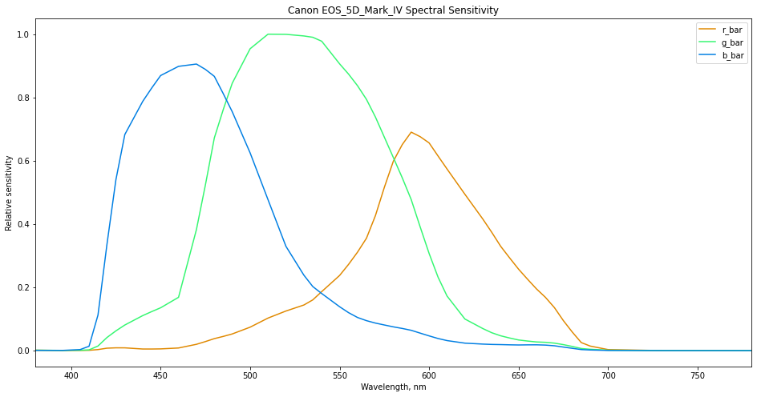

# PhysLight

This repository contains example materials for Weta Digital's *PhysLight* system as presented in the Siggraph 2020 Talk *PhysLight: An End-to-End Pipeline for Scene-Referred Lighting*. [Slides can be found here.](https://drive.google.com/file/d/1a2jGciAmfH9yPdJCXNuNNEs_U07znp9C/view?usp=sharing)

## Foundations

The documentation in docs contains the foundational mathematics

## USD Schema

In the usd folder are a set of schema that can be used to apply to
lights and cameras in USD to store and carry necessary information to
implement a system that communicates lights and camera data necessary
to implement a PhysLight compliant render chain.

## Practical Data

The `data` directory contains the spectral sensitivity curves of a number of cameras as measured with our 'lightsaber' system. It also contains [a notebook](https://github.com/wetadigital/physlight/blob/master/data/plot_curves.ipynb) that loads the data and plots the curves for visual inspection.

## Examples

The [imaging notebook](https://github.com/wetadigital/physlight/blob/master/examples/physlight_imaging.ipynb) shows a simple example of calculating the imaging ratio and checking that it gives the correct response for an idealized camera system.

The [physlight camera model notebook](https://github.com/wetadigital/physlight/blob/master/examples/physlight_camera_model.ipynb) shows how to use the curves to convert from spectral radiance to Camera RGB, solve matrices to go from Camera RGB to XYZ, and compares different approaches for handling white balance.

